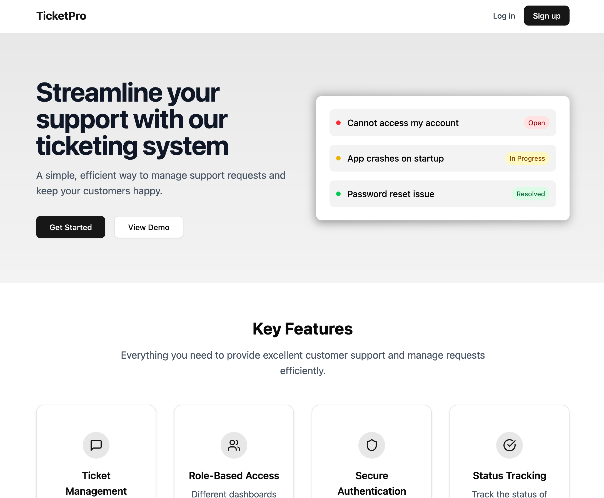

# TicketPro - Support Ticketing System

A modern support ticketing system built with React, TypeScript, and Vite. Manage customer support requests efficiently with role-based access control and real-time status updates.

Hosted Link - https://ticketing-system-lemon.vercel.app/
Admin Accout
- Email: kaleab@gmail.com
- Password: kaleab



## Features

- 🎫 Create and manage support tickets
- 👥 Role-based access (Admin/User dashboards)
- 🔒 Secure authentication system
- 📱 Responsive design
- 🎨 Modern UI with Tailwind CSS
- ⚡ Built with Vite for fast development

## Prerequisites

- Node.js (v18 or higher)
- npm or yarn

## Getting Started

1. Clone the repository:

```bash
git clone https://github.com/kaleab27/ticketing-system
cd ticketing-system
```

2. Install dependencies:

```bash
npm install
```

3. Create a `.env` file in the root directory:

You can find the backend at https://github.com/kaleab27/ticketing-system-backend/

```bash
VITE_BACKEND_ENDPOINT=[the endpoint to your backend]
```

4. Start the development server:

```bash
npm run dev
```

The application will be available at `http://localhost:5173`

## Available Scripts

- `npm run dev` - Start development server
- `npm run build` - Build for production
- `npm run lint` - Run ESLint
- `npm run preview` - Preview production build

## Tech Stack

- React 19
- TypeScript
- Vite
- TanStack Query
- Tailwind CSS
- Radix UI Components
- React Router
- date-fns

## Contributing

1. Fork the repository
2. Create your feature branch (`git checkout -b feature/new-feature`)
3. Commit your changes (`git commit -m 'Add some new feature'`)
